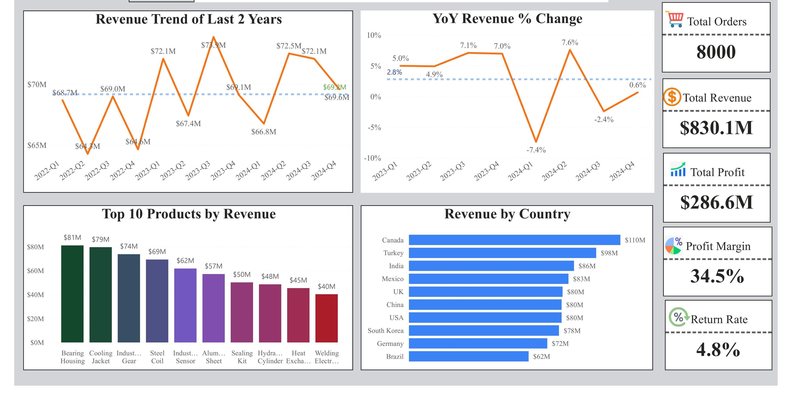

# Star Schema Data Model & Advanced Analytics (Power BI)

## Dashboard Preview

## Overview
This project focuses on building a robust Power BI data model using a star schema design. It demonstrates how multi-table relationships, optimized modeling, and advanced DAX measures can improve analytical performance and scalability.

## Dataset & Model
The dataset consists of multiple related tables structured into a star schema:

- Fact table containing transactional data  
- Dimension tables such as date, customer, and product  
- Relationships built to enable efficient filtering and aggregation  

The model was optimized for performance and analytical flexibility.

## Key Concepts Applied
- Star Schema Data Modeling  
- Fact & Dimension Table Design  
- Relationship Management  
- Filter Context Handling  
- Time Intelligence  

## Key KPIs & Measures
- Total Sales / Revenue  
- Order Count  
- Customer Metrics  
- Time-based Analysis (Monthly trends, growth)  

## Dashboard Features
- Multi-table filtering across dimensions  
- Time-based trend analysis  
- Clean and structured visuals  
- Performance-optimized calculations  

## Tools Used
- Power BI  
- DAX  
- Data Modeling  

## Files Included
- Power BI file (.pbix)  
- Dashboard PDF  
- Dashboard image preview  

## Key Insights
- Star schema structure significantly improves report performance  
- Proper relationships enable accurate cross-filtering  
- Time intelligence provides deeper business understanding  
